# Lab 1：如何安裝 Raspberry Pi 系統


## 1) 格式化記憶卡（清除分割區）

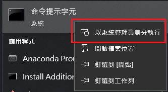

以系統管理員開啟命令提示字元（或 PowerShell），執行 `diskpart` 清除 microSD 分割區（請務必選對磁碟）：

```text
diskpart
list disk
select disk 2
clean
create partition primary
```

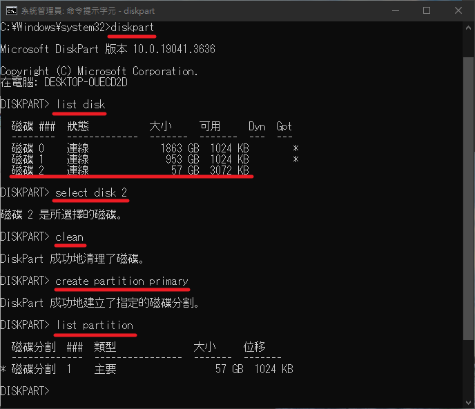

關閉後再用 Windows 的格式化功能重新格式化一次即可。

## 2) 下載並開啟 Raspberry Pi Imager

下載：[Raspberry Pi Imager](https://downloads.raspberrypi.com/imager/imager_latest.exe)

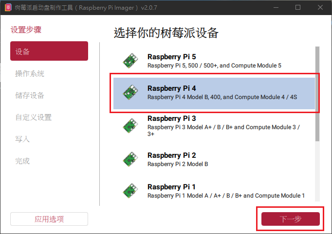

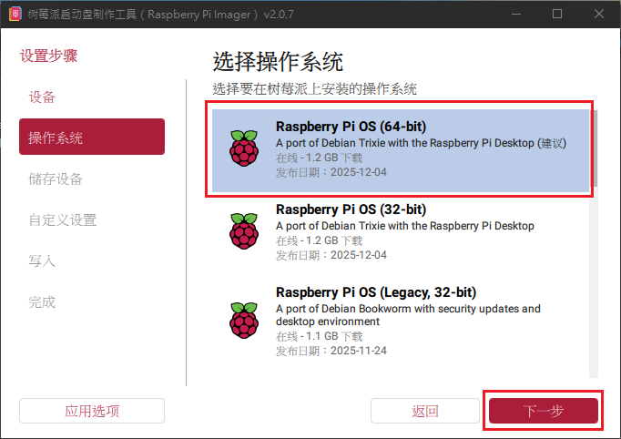


## 3) 選擇作業系統與寫入裝置（microSD）

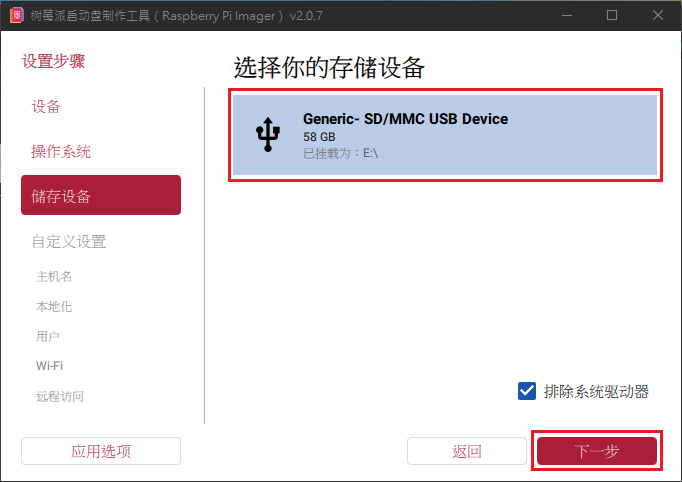

選擇剛剛格式化好的那個磁碟區

## 4) 設定主機名稱（Hostname）

主機名稱盡量不要重複（同一網路下重複會更難找）。

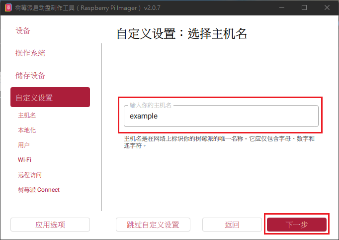

## 5) 其他自訂設定（帳號密碼 / 網路 / SSH 等）

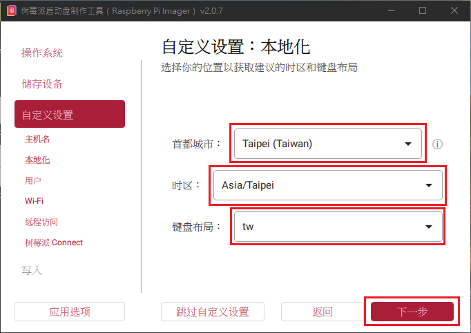

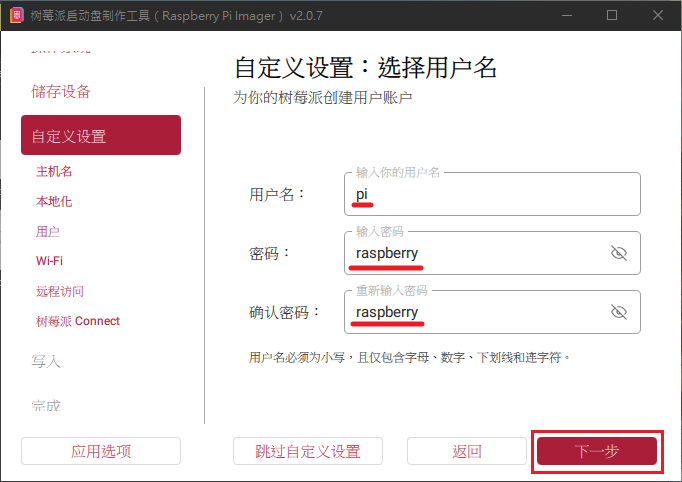

帳號密碼請統一設定相同的（方便課堂操作）。

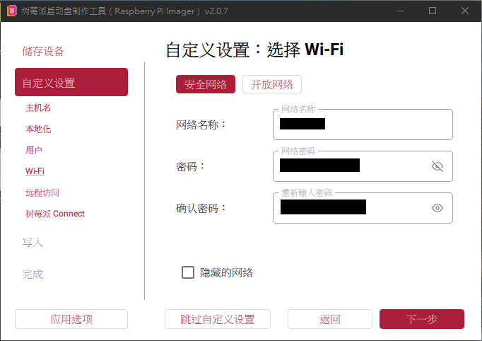

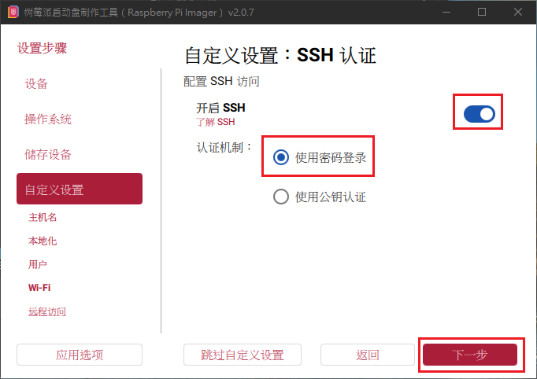

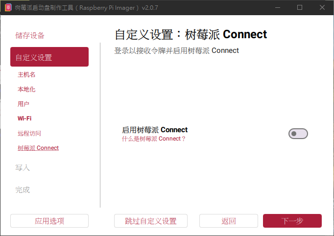

## 6) 寫入映像檔（Write）

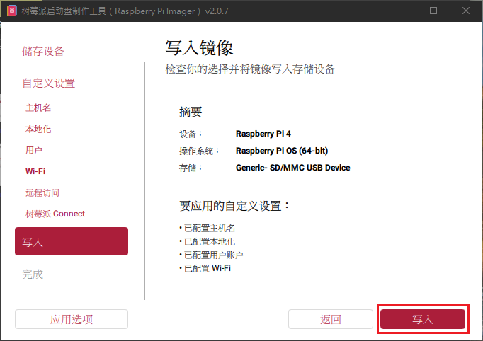

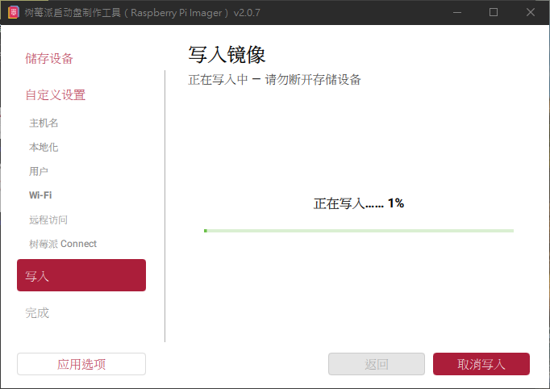

寫入完成後 **不要再把 microSD 拿去格式化**，否則會把系統清掉。

## 7) 首次開機

把 microSD 插入樹莓派，接上電源開機。

## 8) 電腦端連線樹莓派（SSH）

Windows 可用 PuTTY 連線（或直接用 `ssh` 指令也可）。

下載：[PuTTY](https://the.earth.li/~sgtatham/putty/latest/w64/putty-64bit-0.83-installer.msi)

### 8-1) 有線連接

將樹莓派和電腦用網路線連接（沒有網路孔可用 USB 轉有線網卡）。

將電腦的網路來源與樹莓派的網卡「共用」。

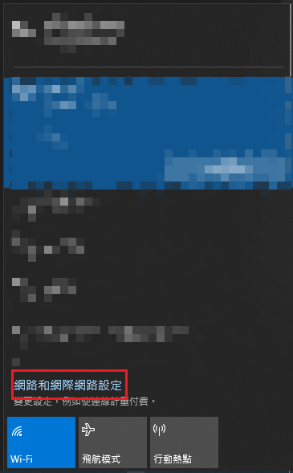

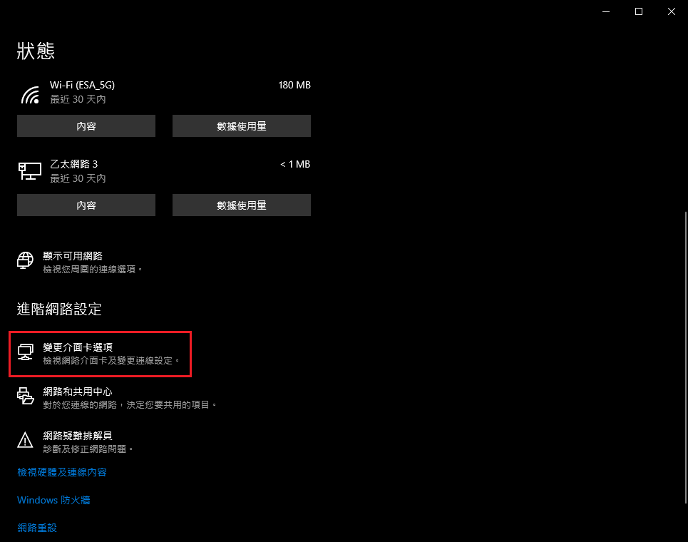

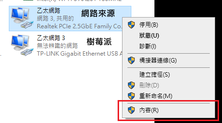

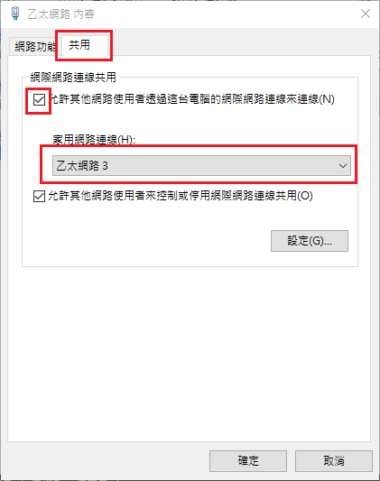

在 cmd 輸入 `arp -a`，查看樹莓派可能的 IP。

```text
arp -a
```

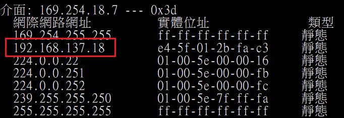

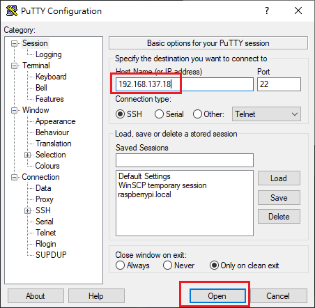

用該 IP 連線後，輸入帳號、密碼即可登入。

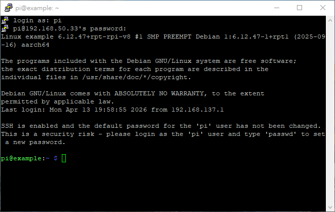

### 8-2) 無線連接（Lab3）

透過 Wi‑Fi 連上同一個網路後，到路由器後台查看 IP（Android 若開基地台也可查看）。

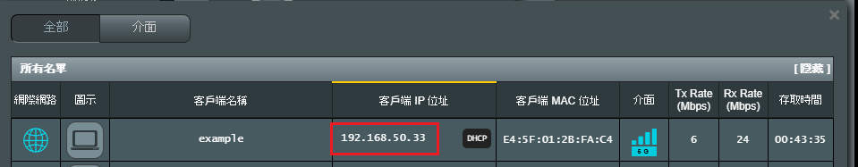

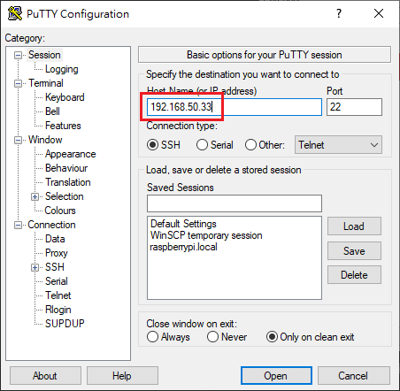

## 9) 使用 VNC 遠端到樹莓派圖形化介面

在樹莓派端執行：

```text
sudo raspi-config
```

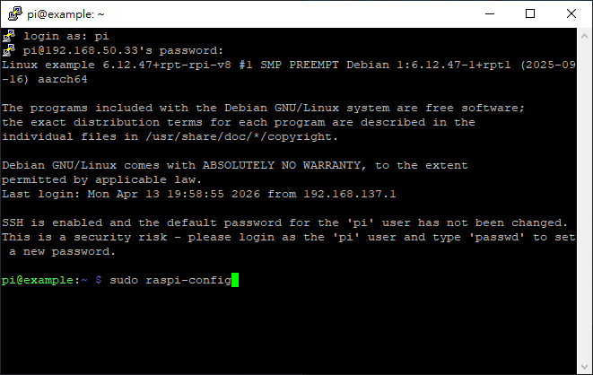

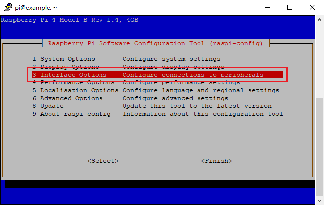

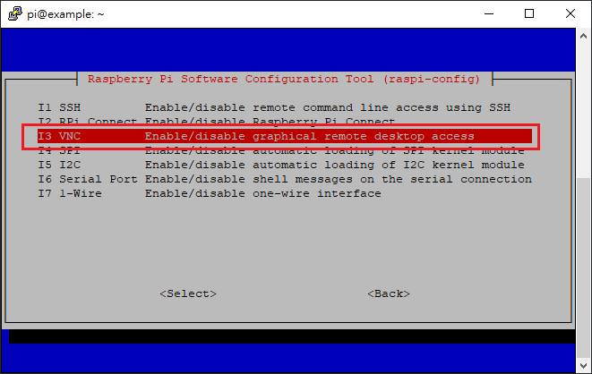

開啟 VNC 遠端功能。

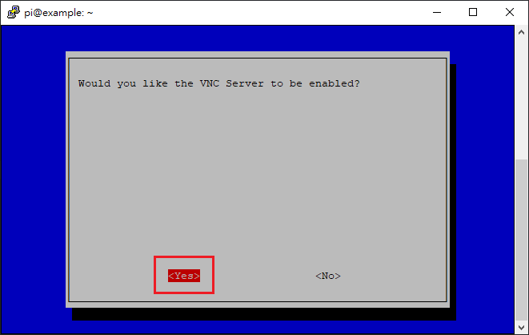

在電腦端安裝 VNC Viewer（建議使用 RealVNC Viewer）：[RealVNC Viewer](https://downloads.realvnc.com/download/file/viewer.files/VNC-Viewer-6.20.529-Windows.exe)

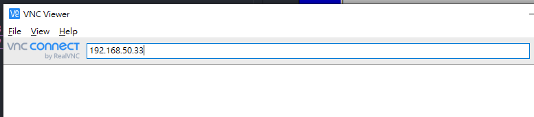

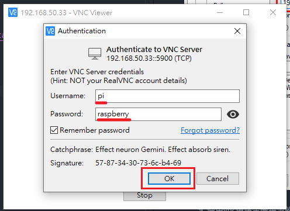

成功透過 VNC 連接到樹莓派。
