# Lab 2：視覺智慧


## 1) 使用 [Teachable Machine](https://teachablemachine.withgoogle.com/) 訓練資料

點選 **Get Started** 後選擇 **Image Project**，並選擇 **Standard Image model**。

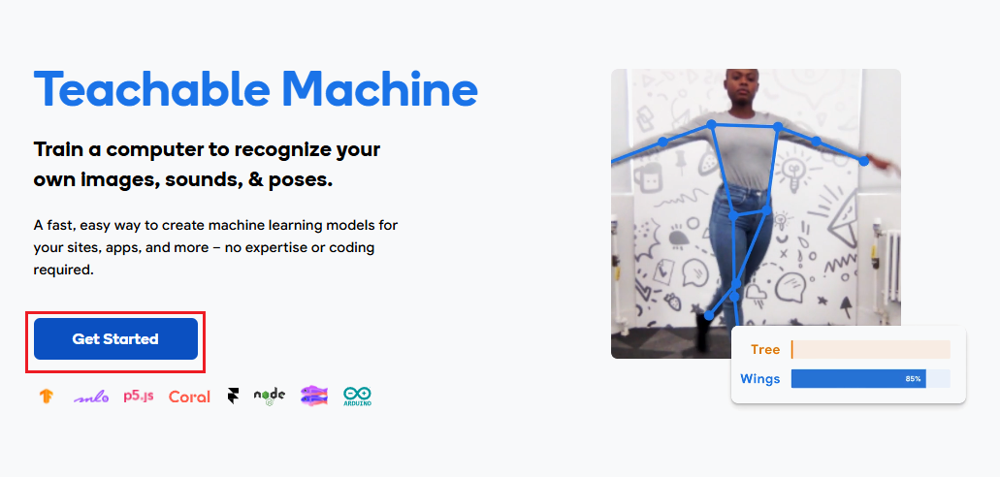

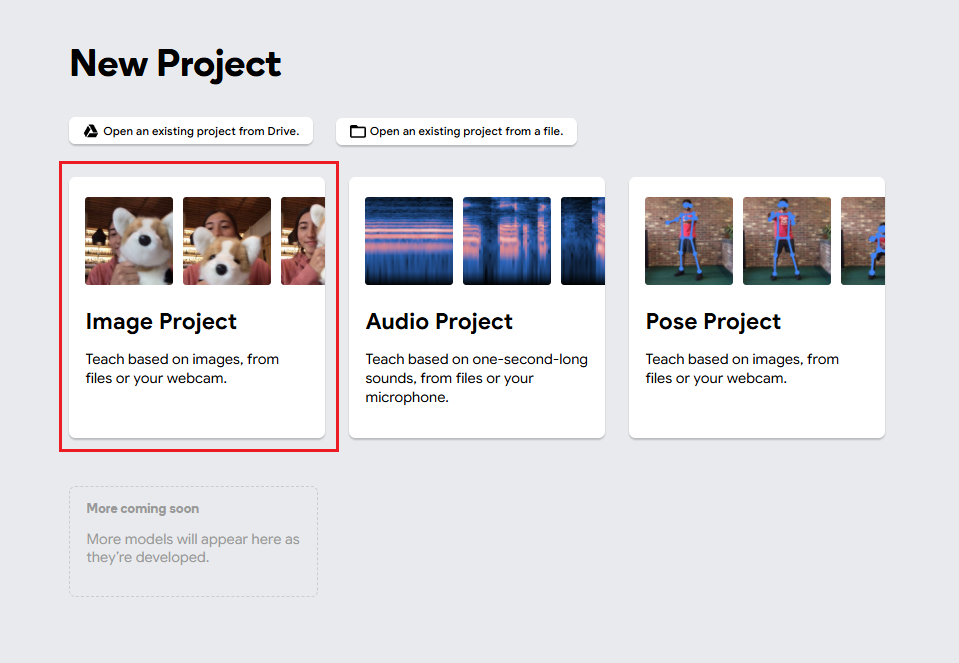

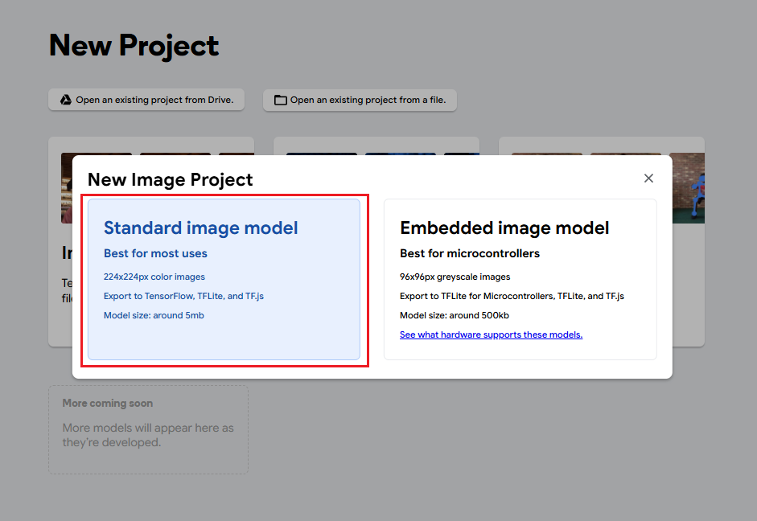


訓練資料可用 webcam 拍攝或選擇 upload 上傳。

照片上傳完畢後，更改 **Class 名稱**（供後續辨識顯示）。

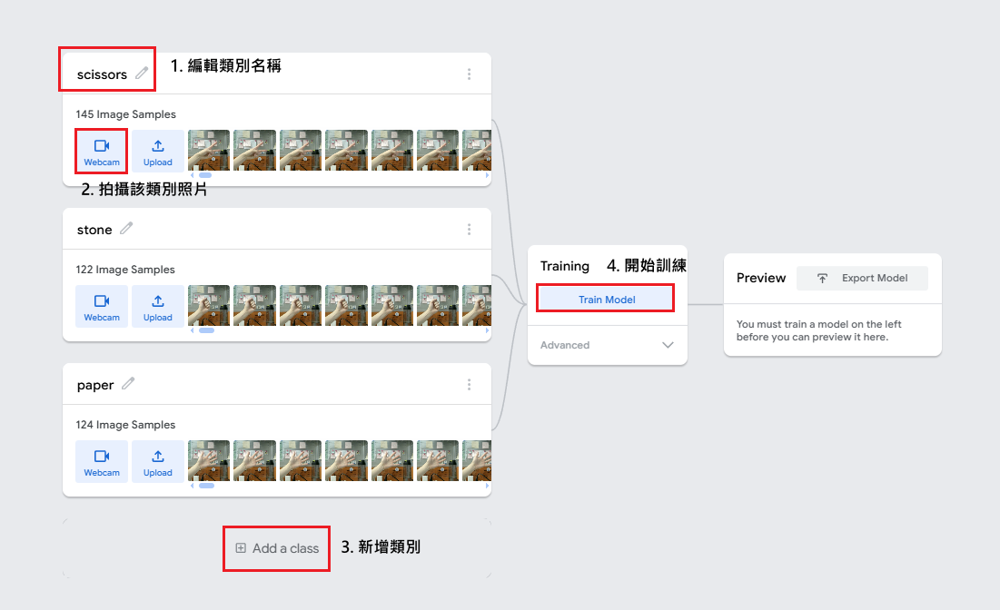


點選 **Train model** 進行訓練（設定皆使用預設值）。

訓練完畢後選擇 **Export Model**（建議匯出 TFLite 供 Raspberry Pi 使用）：

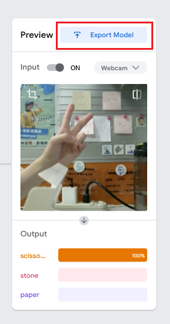

- 選擇 **TensorFlow Lite**
- 匯出建議優先選 **Float16**（較相容）或 **Int8**（檔案較小、速度快）
- 最後下載模型檔（通常會包含 `model.tflite` 與 `labels.txt`）

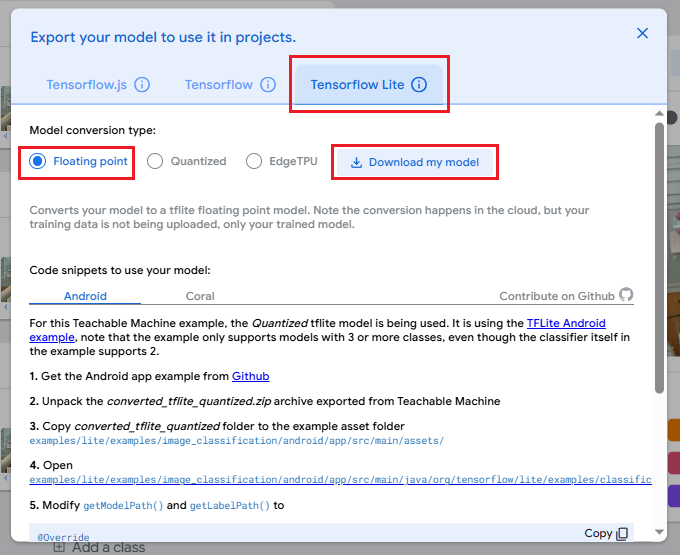


## 2) 安裝與設定 Raspberry Pi 端介面（OpenCV 前置）

使用 VNC 進入 Raspberry Pi。

點選 Raspberry Pi 圖示 → **偏好設定** → **Raspberry Pi 設定**。

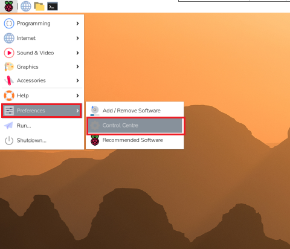


切到 **介面**（Interfaces），將相關選項啟用並重新開機。

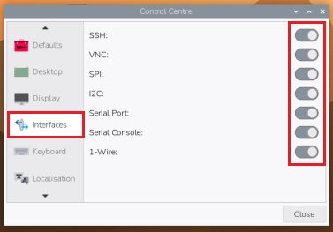

## 3) Raspberry Pi 更新與必要套件（新版流程）

更新並升級套件：

```text
sudo apt update && sudo apt upgrade -y
```
更新後建議重新開機。

安裝常用工具與 Python 套件管理工具：

```text
sudo apt install -y build-essential curl git \
libssl-dev zlib1g-dev libbz2-dev libreadline-dev \
libsqlite3-dev libffi-dev liblzma-dev
```

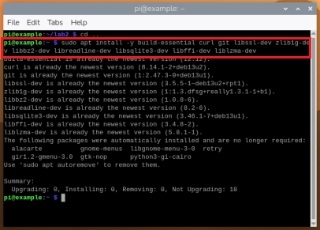

```text
curl https://pyenv.run | bash
```

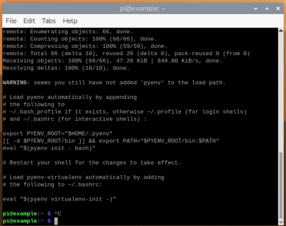

```text
nano ~/.bashrc
```

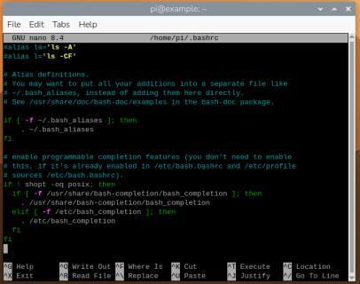

移到最下面並新增以下內容：

```text
export PATH="$HOME/.pyenv/bin:$PATH"
eval "$(pyenv init -)"
eval "$(pyenv virtualenv-init -)"
```

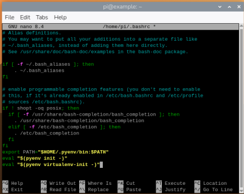

完成後按 `Ctrl + X`，再按 `Y` 與 `Enter` 儲存並離開。

```text
source ~/.bashrc
pyenv install 3.12.3
```

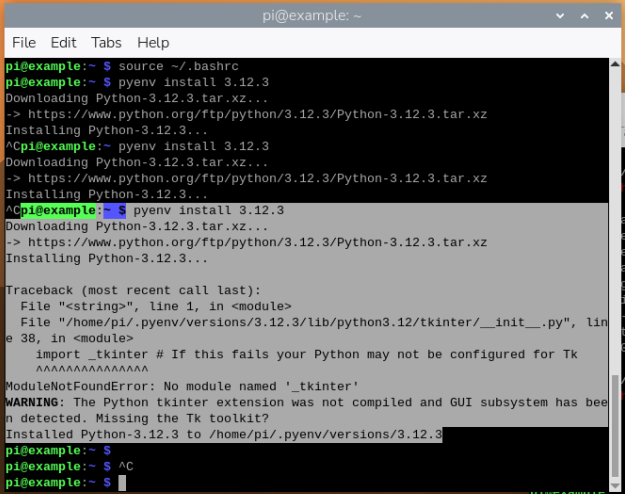


建立環境：

```text
mkdir lab2 && cd lab2
pyenv virtualenv 3.12.3 tf312
pyenv activate tf312
```

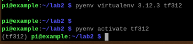

安裝你需要的套件：

```text
pip install --upgrade pip
pip install tensorflow opencv-python numpy
pip uninstall -y flatbuffers
PIP_CONFIG_FILE=/dev/null pip --isolated install --no-cache-dir --index-url https://pypi.org/simple "flatbuffers>=24.3.25"
```

測試 TensorFlow：

```text
python -c "import tensorflow as tf; print(tf.__version__)"
```

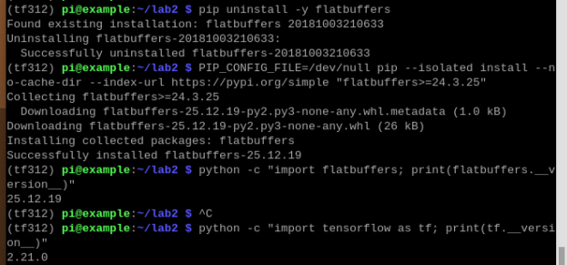


## 4) 把模型和程式碼放到 Raspberry Pi


### 程式碼 [tflite.py](code%20and%20model)

將以下程式碼存成 Raspberry Pi 的 `~/lab2/tflite.py`：

```python
import argparse
import time
from typing import Dict, Tuple, List

import cv2
import numpy as np
import tensorflow as tf


def load_labels(path: str) -> Dict[int, str]:
    labels: Dict[int, str] = {}
    with open(path, "r", encoding="utf-8") as f:
        for i, line in enumerate(f):
            text = line.strip()
            if not text:
                continue

            # 支援 "0 class_name" 或單純 "class_name"
            parts = text.split(maxsplit=1)
            if len(parts) == 2 and parts[0].isdigit():
                labels[int(parts[0])] = parts[1].strip()
            else:
                labels[i] = text
    return labels


def get_input_spec(interpreter) -> Tuple[int, int, np.dtype]:
    input_details = interpreter.get_input_details()[0]
    _, height, width, _ = input_details["shape"]
    return int(height), int(width), input_details["dtype"]


def crop_center_square(frame: np.ndarray) -> np.ndarray:
    h, w = frame.shape[:2]
    size = min(h, w)
    y0 = (h - size) // 2
    x0 = (w - size) // 2
    return frame[y0:y0 + size, x0:x0 + size]


def preprocess_frame(
    bgr_square: np.ndarray,
    input_h: int,
    input_w: int,
    input_dtype: np.dtype
) -> np.ndarray:
    rgb = cv2.cvtColor(bgr_square, cv2.COLOR_BGR2RGB)
    resized = cv2.resize(rgb, (input_w, input_h), interpolation=cv2.INTER_AREA)

    if input_dtype == np.uint8:
        return resized.astype(np.uint8)

    # Teachable Machine 的 float 模型通常吃 0~1
    return (resized.astype(np.float32) / 255.0).astype(input_dtype, copy=False)


def dequantize_output(output: np.ndarray, output_details: dict) -> np.ndarray:
    if output_details["dtype"] == np.uint8:
        scale, zero_point = output_details["quantization"]
        if scale and scale > 0:
            return scale * (output.astype(np.float32) - zero_point)
        return output.astype(np.float32)

    return output.astype(np.float32, copy=False)


def softmax_if_needed(scores: np.ndarray) -> np.ndarray:
    # Teachable Machine 多半已經是機率，但保守處理
    if np.all(scores >= 0.0) and np.all(scores <= 1.0) and abs(float(np.sum(scores)) - 1.0) < 0.05:
        return scores

    scores = scores - np.max(scores)
    exp_scores = np.exp(scores)
    return exp_scores / np.sum(exp_scores)


def classify(interpreter, input_image: np.ndarray, top_k: int = 1) -> List[Tuple[int, float]]:
    input_details = interpreter.get_input_details()[0]
    output_details = interpreter.get_output_details()[0]

    input_tensor = np.expand_dims(input_image, axis=0)
    interpreter.set_tensor(input_details["index"], input_tensor)
    interpreter.invoke()

    output = interpreter.get_tensor(output_details["index"])
    output = np.squeeze(output)
    output = dequantize_output(output, output_details)
    probs = softmax_if_needed(output)

    k = min(top_k, probs.shape[0])
    top_indices = np.argsort(-probs)[:k]
    return [(int(i), float(probs[i])) for i in top_indices]


def put_overlay_text(
    image: np.ndarray,
    text: str,
    x: int = 10,
    y: int = 40,
    font_scale: float = 1.0,
    thickness: int = 2
) -> None:
    cv2.putText(
        image,
        text,
        (x, y),
        cv2.FONT_HERSHEY_SIMPLEX,
        font_scale,
        (0, 0, 255),  # BGR: 紅色
        thickness,
        cv2.LINE_AA,
    )


def main() -> None:
    parser = argparse.ArgumentParser(
        formatter_class=argparse.ArgumentDefaultsHelpFormatter
    )
    parser.add_argument("--model", required=True, help="Path to .tflite model")
    parser.add_argument("--labels", required=True, help="Path to labels.txt")
    parser.add_argument("--camera", type=int, default=0, help="Camera index")
    parser.add_argument("--width", type=int, default=640, help="Capture width")
    parser.add_argument("--height", type=int, default=480, help="Capture height")
    parser.add_argument("--top_k", type=int, default=1, help="Top K predictions")
    args = parser.parse_args()

    labels = load_labels(args.labels)

    interpreter = tf.lite.Interpreter(model_path=args.model)
    interpreter.allocate_tensors()

    input_h, input_w, input_dtype = get_input_spec(interpreter)

    cap = cv2.VideoCapture(args.camera)
    cap.set(cv2.CAP_PROP_FRAME_WIDTH, args.width)
    cap.set(cv2.CAP_PROP_FRAME_HEIGHT, args.height)

    if not cap.isOpened():
        raise RuntimeError(f"Cannot open camera index {args.camera}")

    prev_time = time.time()
    fps = 0.0

    while True:
        ok, frame = cap.read()
        if not ok or frame is None:
            time.sleep(0.01)
            continue

        square = crop_center_square(frame)
        input_img = preprocess_frame(square, input_h, input_w, input_dtype)

        t0 = time.time()
        results = classify(interpreter, input_img, top_k=args.top_k)
        infer_ms = (time.time() - t0) * 1000.0

        now = time.time()
        dt = now - prev_time
        prev_time = now
        if dt > 0:
            fps = 1.0 / dt

        if results:
            class_id, prob = results[0]
            class_name = labels.get(class_id, str(class_id))
            overlay = f"{class_name} {prob:.3f} | {infer_ms:.0f}ms | {fps:.1f} FPS"
        else:
            overlay = f"no result | {infer_ms:.0f}ms | {fps:.1f} FPS"

        put_overlay_text(square, overlay, x=10, y=35, font_scale=1.0, thickness=2)

        cv2.imshow("Detecting...", square)

        key = cv2.waitKey(1) & 0xFF
        if key == ord("q"):
            break

    cap.release()
    cv2.destroyAllWindows()


if __name__ == "__main__":
    main()
```

### 傳送模型檔（WinSCP）

使用 WinSCP（圖形化）把模型檔與 `labels.txt` 放到 Raspberry Pi 的 `~/lab2/`。

下載：[WinSCP](https://winscp.net/download/WinSCP-6.5.6-Setup.exe/download)

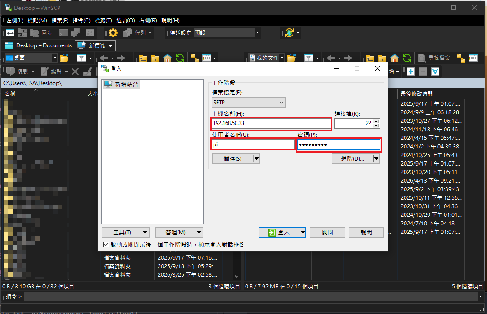

將檔案拖至 `lab2` 資料夾中。

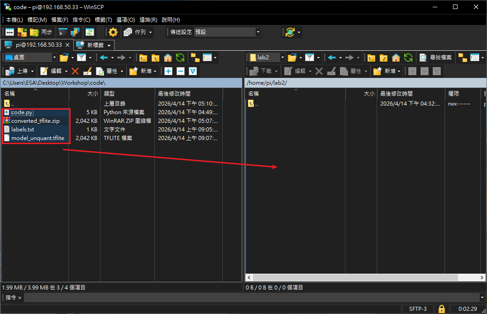

## 5) 偵測與測試（OpenCV + TFLite）

連接上 Webcam 至 Raspberry Pi USB 中。


### 執行方式

在 Raspberry Pi 端執行：

```text
python3 tflite.py --model model_unquant.tflite --labels labels.txt
```

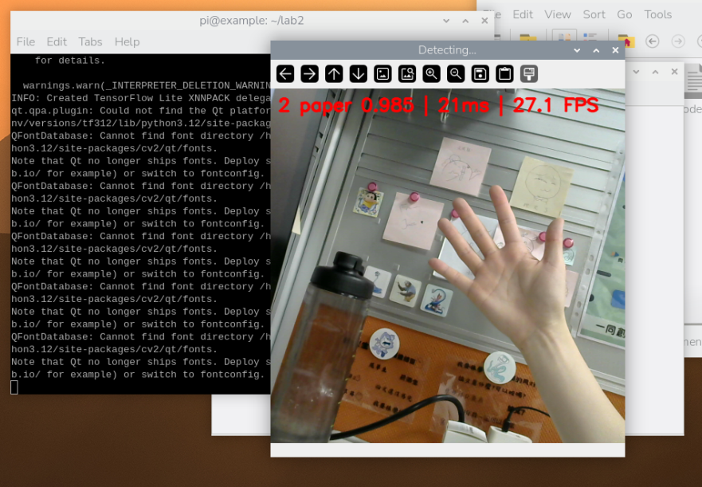


網路攝影機照射到的物體會顯示於畫面中。

