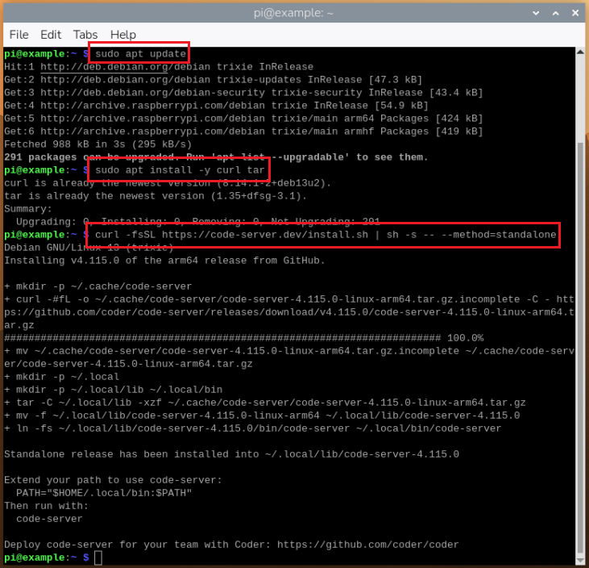
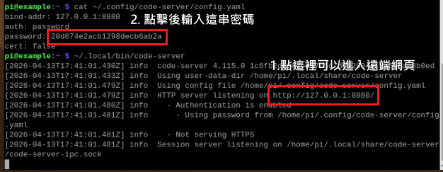
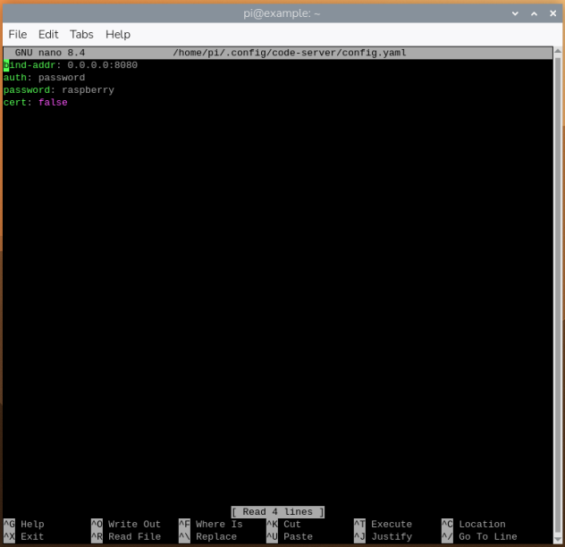
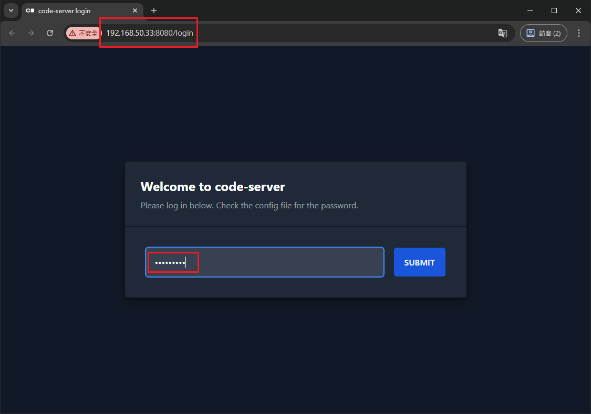
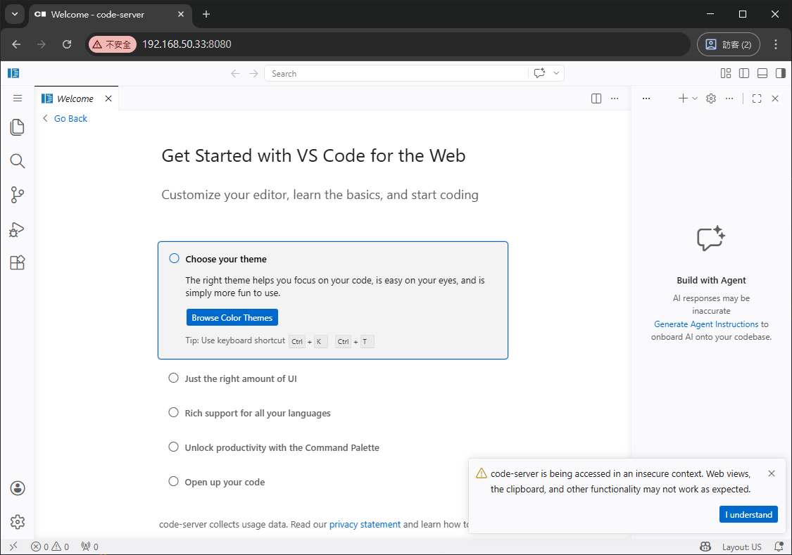
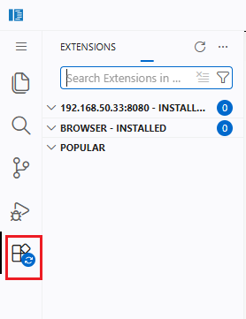
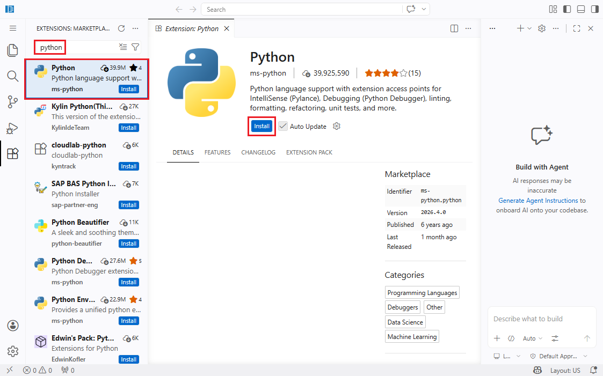
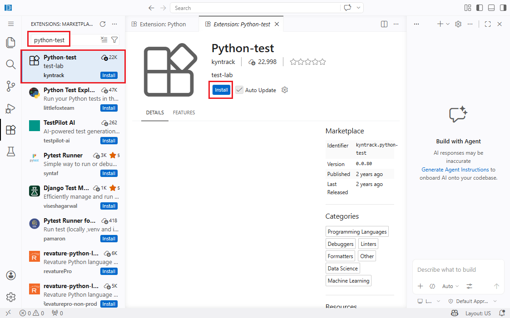
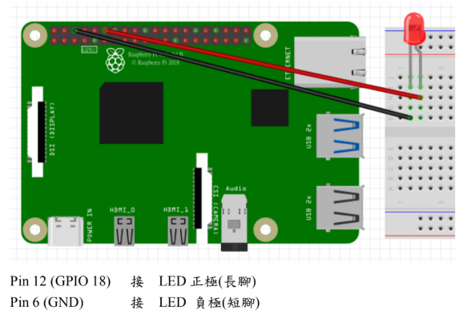
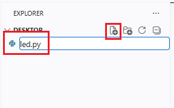

# Lab 4：雲端管控test

在 Raspberry Pi 4 上部署 code-server。

## 1) 安裝主程式與相依套件

先更新套件索引，並安裝流程會用到的 `curl` 與 `tar`。

```bash
sudo apt update
sudo apt install -y curl tar
```

接著使用官方 install script 的 `standalone` 方式安裝 code-server。此方式適合 arm64，且可避開較多原生模組編譯問題。

```bash
curl -fsSL https://code-server.dev/install.sh | sh -s -- --method=standalone
```



第一次啟動後，系統會自動建立設定檔，位置通常如下。

```bash
cat ~/.config/code-server/config.yaml
```

安裝完成後，可先直接執行下列指令，確認 code-server 可以正常啟動。

```bash
~/.local/bin/code-server
```

（按 `Ctrl + C` 可以終止伺服器）



## 2) 改成區網可連線

預設情況下，code-server 只會綁定在本機的 `127.0.0.1:8080`。若希望同一區網內的電腦也能透過瀏覽器連入 Raspberry Pi，就需要修改設定檔。

```bash
nano ~/.config/code-server/config.yaml
```

請將內容調整為下列範例

```bash
bind-addr: 0.0.0.0:8080
auth: password
password: raspberry
cert: false
```



完成後按 `Ctrl + X`，再按 `Y` 與 `Enter` 儲存並離開

修改完成後，重新啟動 code-server，讓新設定生效。

```bash
pkill -f code-server
~/.local/bin/code-server
```

之後即可在同一區網的其他電腦上，以瀏覽器開啟下列網址登入。

```bash
http://(你的RPi板的IP):8080
```

例如：若 Raspberry Pi 的 IP 是 `192.168.50.33`，則可輸入 `http://192.168.50.33:8080`。

進入頁面後密碼直接輸入 `raspberry` 即可登入。





出現此畫面表示成功遠端。

## 3) 安裝 Python 套件（code-server）

進入 code-server 後，先點擊左方的圖標搜尋 Python 擴充套件，並安裝下圖兩個套件（`Python`、`Python-test`）。







## 4) 運行 LED 遠端控制程式

### 4-1) 配置 LED 電路

將 LED、電阻和杜邦線以下圖的方式配置在麵包板上並與樹莓派連接。



### 4-2) 新建程式碼

切換到桌面資料夾，例如：

`http://192.168.50.33:8080/?folder=/home/pi/Desktop`



打開新的 Python 原始碼，並將以下程式碼複製貼上：

```python
from gpiozero import LED
import time

led = LED(18)

while True:
    led.on()
    time.sleep(1)
    led.off()
    time.sleep(1)
```

貼上後按運行，就能觀察到 LED 燈閃爍。
